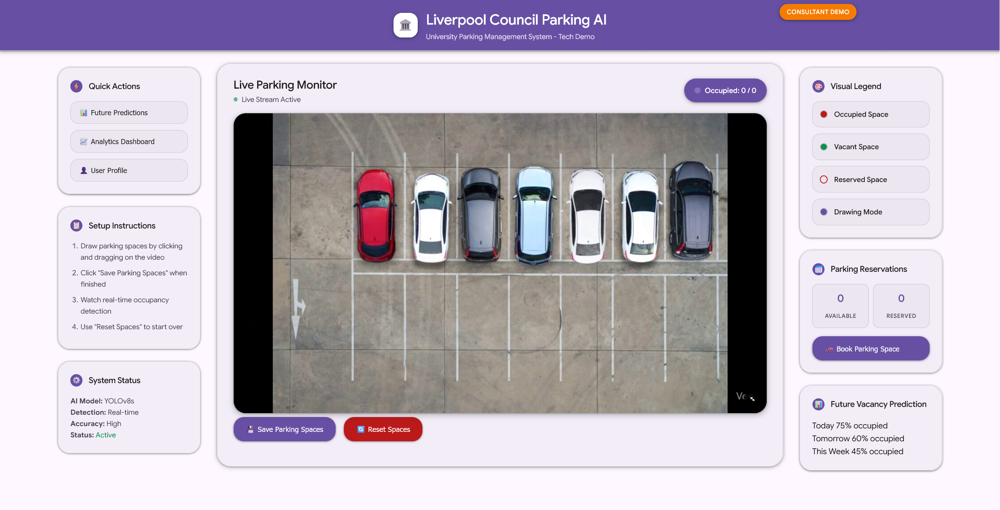
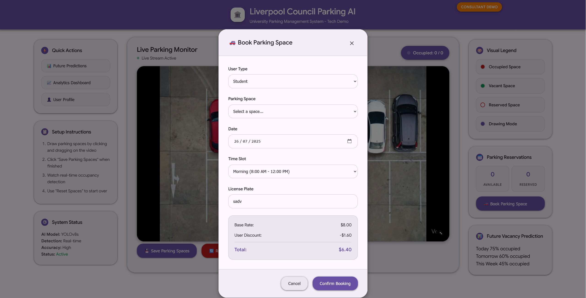

# 🏛️ Liverpool Council Parking AI - Tech Demo

> **University Parking Management System - Consultant Tech Demo**

A cutting-edge AI-powered parking management system that uses computer vision to monitor parking spaces in real-time. This system demonstrates how artificial intelligence can revolutionize parking management for universities and municipal councils.


## 📸 Screenshots

### Main Dashboard


*The main interface showing real-time video feed with vehicle detection, interactive parking space annotation, and live occupancy monitoring.*

### Booking System


*Interactive booking modal with space selection, time-based pricing, and QR code generation for parking permits.*

## 🎯 Project Overview

This system showcases a complete AI-powered parking management solution featuring:

- **Real-time vehicle detection** using YOLOv8
- **Interactive parking space annotation** with manual bounding box drawing
- **Live occupancy monitoring** with color-coded status indicators
- **Professional booking system** with QR code generation
- **Modern Material Design 3 UI** with Google Pixel-inspired aesthetics
- **Future vacancy predictions** and analytics dashboard
- **Responsive web interface** for both desktop and mobile

## ✨ Key Features

### 🤖 AI-Powered Detection
- **YOLOv8 Integration**: State-of-the-art object detection for vehicle recognition
- **Real-time Tracking**: Live vehicle detection with confidence scoring
- **Occupancy Analysis**: Automatic detection of parking space availability
- **Visual Feedback**: Yellow bounding boxes and labels for all detected vehicles

### 🎨 Interactive Interface
- **Manual Space Annotation**: Draw and define parking spaces with mouse interaction
- **Live Video Stream**: Real-time MJPEG streaming with overlay graphics
- **Dynamic Updates**: Real-time occupancy count and status updates
- **Professional UI**: Material Design 3 with glass morphism effects

### 📱 Booking System Demo
- **Space Reservations**: Interactive booking with time-based pricing
- **QR Code Generation**: Digital parking permits (demo implementation)
- **User Type Pricing**: Different rates for students, faculty, staff, and visitors
- **Visual Status Indicators**: Reserved spaces with hazard line patterns

### 📊 Analytics & Predictions
- **Occupancy Statistics**: Real-time count of available vs. occupied spaces
- **Future Predictions**: Demo charts showing predicted vacancy patterns
- **System Status Monitoring**: Live system health and performance metrics

## 🚀 Quick Start

### Prerequisites
- Python 3.8 or higher
- OpenCV 4.5+
- Flask 2.0+
- Ultralytics (YOLOv8)

### Installation

1. **Clone the repository**
   ```bash
   git clone https://github.com/Memeronii/CompVisionParking.git
   cd CompVisionParking
   ```

2. **Install dependencies**
   ```bash
   pip install -r requirements.txt
   ```

3. **Download YOLO model** (if not already present)
   ```bash
   # The yolov8s.pt model should be included in the repository
   # If missing, it will be automatically downloaded on first run
   ```

4. **Add your video file**
   ```bash
   # Place your parking lot video in the videos/ directory
   # Default: videos/Car_Park_Timelapse_Video_Generated.mp4
   ```

5. **Run the application**
   ```bash
   python app.py
   ```

6. **Access the system**
   ```
   Open your browser and navigate to: http://localhost:5000
   ```

## 🎮 Usage Guide

### Initial Setup
1. **Load the System**: The application will start with a live video feed
2. **Draw Parking Spaces**: Use your mouse to draw rectangular boxes around parking spaces
3. **Save Configuration**: Click "Save Parking Spaces" to store your annotations
4. **Monitor Live**: Watch as the system detects vehicles and updates occupancy status

### Drawing Parking Spaces
- **Click and Drag**: Click anywhere on the video and drag to create a parking space box
- **Multiple Spaces**: Draw as many parking spaces as needed
- **Visual Feedback**: Green boxes indicate vacant spaces, red indicates occupied
- **Reset Option**: Use "Reset Spaces" to clear all annotations and start over

### Booking System Demo
1. **View Available Spaces**: Check the "Parking Reservations" panel
2. **Book a Space**: Click "Book Parking Space" to open the booking modal
3. **Select Details**: Choose space, date, time, and user type
4. **Confirm Booking**: Review pricing and confirm your reservation
5. **QR Code**: Receive a digital parking permit (demo QR code)

## 🏗️ Technical Architecture

### Backend (Flask)
- **Video Processing**: OpenCV-based frame capture and processing
- **AI Detection**: YOLOv8 integration for vehicle recognition
- **Real-time Streaming**: MJPEG streaming with multipart responses
- **API Endpoints**: RESTful endpoints for space management and occupancy data

### Frontend (HTML/CSS/JavaScript)
- **Interactive Canvas**: Mouse-driven parking space annotation
- **Real-time Updates**: AJAX polling for live occupancy status
- **Material Design 3**: Modern UI with CSS custom properties
- **Responsive Layout**: 3-column grid system with adaptive sizing

### AI/ML Components
- **YOLOv8 Model**: `yolov8s.pt` for vehicle detection
- **Object Classification**: Car detection with confidence scoring
- **Spatial Analysis**: Overlap detection for occupancy determination
- **Performance Optimization**: Frame skipping for smooth video playback

## 📁 Project Structure

```
CompVisionParking/
├── app.py                      # Main Flask application
├── templates/
│   └── index.html             # Frontend interface
├── videos/
│   └── Car_Park_Timelapse_Video_Generated.mp4  # Demo video
├── screenshots/                # Project screenshots
│   ├── main-dashboard.png     # Main interface screenshot
│   └── booking-system.png     # Booking system screenshot
├── yolov8s.pt                 # YOLOv8 model file
├── requirements.txt           # Python dependencies
├── .gitignore                 # Git ignore rules
└── README.md                  # This file
```

## 🔧 Configuration

### Video Source
Edit `app.py` to change the video source:
```python
VIDEO_PATH = os.path.join('videos', 'your_video_file.mp4')
```

### YOLO Model
The system uses `yolov8s.pt` by default. You can change to other models:
```python
yolo_model = YOLO('yolov8n.pt')  # Faster, less accurate
yolo_model = YOLO('yolov8m.pt')  # Balanced
yolo_model = YOLO('yolov8l.pt')  # Slower, more accurate
```

### Performance Settings
Adjust frame processing frequency in `app.py`:
```python
# Only update occupancy detection every N frames
if frame_count % 3 == 0:  # Change 3 to adjust frequency
```

## 🎨 UI/UX Features

### Material Design 3 Theme
- **Color Palette**: Purple-based theme with CSS custom properties
- **Glass Morphism**: Translucent cards with backdrop blur effects
- **Typography**: Google Sans font family for modern appearance
- **Shadows**: Layered shadow system for depth perception

### Responsive Layout
- **3-Column Grid**: Left sidebar, center video, right sidebar
- **Adaptive Sizing**: Flexible video container with minimum width constraints
- **Mobile-Friendly**: Responsive design for various screen sizes

### Interactive Elements
- **Hover Effects**: Smooth transitions and visual feedback
- **Modal Dialogs**: Professional booking and confirmation modals
- **Real-time Updates**: Live occupancy badges and status indicators

## 🔮 Future Enhancements

### Planned Features
- **Multi-camera Support**: Integration with multiple parking lot cameras
- **Advanced Analytics**: Machine learning-based occupancy prediction
- **Mobile App**: Native iOS/Android applications
- **Payment Integration**: Real payment processing for bookings
- **User Authentication**: Secure login and user management
- **API Documentation**: Comprehensive API for third-party integrations

### Technical Improvements
- **Database Integration**: Persistent storage for bookings and configurations
- **WebSocket Support**: Real-time bidirectional communication
- **Docker Deployment**: Containerized application for easy deployment
- **Performance Optimization**: GPU acceleration for YOLO processing

## 🤝 Contributing

This is a consultant tech demo project. For questions or collaboration opportunities, please contact the development team.

## 📄 License

This project is developed as a consultant tech demo for Liverpool Council. All rights reserved.

## 🙏 Acknowledgments

- **Liverpool Council**: Project sponsor and stakeholder
- **Ultralytics**: YOLOv8 object detection framework
- **OpenCV**: Computer vision library
- **Flask**: Web framework
- **Material Design**: UI/UX design system

---
